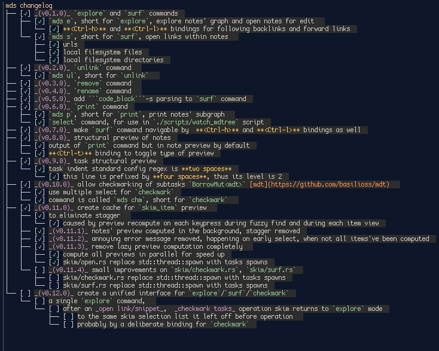

# Short showcast

[](https://asciinema.org/a/QtWI1lMVbQ52LMP7Yf6u7QvAA)

# [Installation](./INSTALLATION.md)

# Overview

1. All of `explore`, `surf` and `checkmark` commands start in `explore` mode.
2. In `explore` mode `< Ctrl-t >`, `< Ctrl-h >` (backlinks) and `< Ctrl-l >` (forwardlinks) bindings are available.
3. Any note can be linked to any number of other notes via a directed `->` link. 
4. Note names are rendered as markdown in skim picker/preview.
5. A note having only a name, but devoid of earthly file body is also considered a note, but is called a tag instead.
6. `< Ctrl-t >` keybinding may be used to toggle 
  between **structural links** -> **structural task** -> **details** -> **(cycle)** preview of current note or 
  note subgraph respectively. This rendered `p/print` command somewhat redundant. 
7. `explore` command can switch to `surf` or `checkmark` mode and then back to `explore` mode. `explore` command includes the functionality of most of other commands (`rename`, `delete`, `surf`, etc).
8. `surf` command/mode may be used for searching for all `[description](url/file_path/dir_path)` markdown links and `'''code_block'''` found downwards from a note S, selected for `surf`.
9. Destination in `[description](destination)` markdown links is matched against `world.surf-parsing.url-regex` regex in [config](./config.kdl). If it matches, it's considered a url link. Otherwise, it's considered local filesystem link, either absolute or relative (no `file://` protocol prefix required).   
10. `'''code_block'''` description is parsed as the first line of `'''code_block'''`, comments `# bash comment` or `// C comment` may be used for informative descriptions.
11. Syntax in `'''code_block'''`can be hinted for highlight in preview by specifying tag \`\`\`syntax_tag, e.g. \`\`\`bash or \`\`\`javascript.
11. `checkmark` command/mode may be used to parse out trees of `- [ ] description` task items and allows navigating/toggling them into `- [x] description` state.
12. More details are available from help/keybindings below and rigorous practice.

# Help

  

  ```
  mds -h
  ```

  ```
  meudeus v0.15.4
  a skim shredder for plain-text papers

  Usage: mds [OPTIONS] <COMMAND>

  Commands:
    debug-cfg  print Debug representtion of config
    init       `initialize` .sqlite database in notes dir, specified by config
    note       create a note [aliases: n]
    tag        create a tag (note without file body) [aliases: t]
    select     select note S, i.e. print its name to stdout
    link       link 2 notes A -> B, selected twice in skim interface [aliases: l]
    unlink     unlink 2 notes A -> B, selected twice in skim interface [aliases: ul]
    remove     remove note R, selected in skim interface [aliases: rm]
    rename     rename note R, selected in skim interface [aliases: mv]
    print      print subgraph of notes and links reachable downwards from selected note P [aliases: p]
    explore    explore notes by <c-h> (backlinks) , <c-l> (links forward) [aliases: ex]
    surf       surf through all links and code snippets found downwards from selected note S [aliases: s]
    checkmark  checkmark, toggle state TODO/DONE of multiple task items, found in a selected note C [aliases: k]
    help       Print this message or the help of the given subcommand(s)

  Options:
    -c, --color    whether color output should be forced
    -h, --help     Print help
    -V, --version  Print version
  ```

# Keybindings of `explore` command

- `explore` mode

 | Binding   | Effect                                                                     |
 |---------|------------------------------------------------------------------------------|
 | Ctrl-c  | Abort                                                                        |
 | ESC | Abort                                                                            |
 | Enter | Open selected note in editor                                                   |
 | Ctrl-h  |  Populate skim selection with backlinks of selected note                     |
 | Ctrl-l  |  Populate skim selection with forward links of selected note                 |
 | Ctrl-t  |  Toggle preview type of notes                                                |
 | Ctrl-w  |  Widen skim selection to full list of all notes                              |
 | Ctrl-s  |  Switch mode to `surf` with the selected note as the root of surfed subtree  |
 | Ctrl-k  |  Switch mode to `checkmark` for task items of selected note                  |
 | Alt-r  |  Rename selected note                                                         |
 | Alt-l  |  Create a link from selected note to another, selected in next skim iteration |
 | Alt-u  |  Remove a link from selected note to one of its forward links                 |
 | Alt-d  |  Remove selected note                                                         |
 | Alt-c  |  Create a new note/tag, which will become one of selected note's forward links|
 | Alt-f  |  Toggle/invert the direction of links. Backlinks become forward links         |
 | Alt-s  |  Splice note: populate selection list with its children, reachable by forward links|
 | Alt-n  |  Narrow selection to single or multiple selected notes|
 | Alt-o  |  Decrease threshold of nested level for unlisted inner items (links, task items) |
 | Alt-p  |  Increase threshold of nested level for unlisted inner items (links, task items) |

- `surf` mode

 | Binding   | Effect                                                                             |
 |---------|--------------------------------------------------------------------------------------|
 | Ctrl-c  | Abort                                                                                |
 | ESC | Abort                                                                                    |
 | Enter | Open selected `[markdown link]()` with a command, depending on [markdown link]()'s type|
 | Ctrl-j  |  Jump to selected `[markdown link]()`'s position in editor                             |
 | Ctrl-e  |  Return to `explore` mode (in `explore` command) or abort `surf` command             |

- `checkmark` mode

 | Binding   | Effect                                                                      |
 |---------|-------------------------------------------------------------------------------|
 | Ctrl-c  | Abort                                                                         |
 | ESC | Abort                                                                             |
 | TAB (skim) | Select and move down                                                       |
 | Shift+TAB (skim) | Select and move up                                                   |
 | Enter | Toggle state todo/done of multiple selected task items                          |
 | Ctrl-j  |  Jump to selected task item's position in editor                              |
 | Ctrl-y  |  Copy selected task item's subtree to clipboard                               |
 | Ctrl-w  |  Widen context of task items to all tasks, parse again from file              |
 | Ctrl-l  |  Narrown context of task items to subtree of selected task item               |
 | Ctrl-e  |  Return to `explore` mode (in `explore` command) or abort `checkmark` command |

- common more and less obvious keybindings from vanilla skim

 | Binding   | Effect                                                                      |
 |---------|-------------------------------------------------------------------------------|
 | Ctrl-p| Move up by one in skim selection                                                                  |
 | Ctrl-n| Move down by one in skim selection                                         |
 | PageUp| Move up by many items in skim selection                                         |
 | PageDown|Move down by many items in skim selection                                      |
 | Shift-ArrowUp| Scroll preview port up (without mouse)                                   |
 | Shirt-ArrowDown| Scroll preview port down (without mouse)                               |

# Colors 

- Some color themes for markdown elements can be found at [rainglow/sublime](https://github.com/rainglow/sublime)
and previewed at this awesome website [rainglow.io](https://rainglow.io/preview/).
- if the patchwork in markdown irritates you, please remember, that `settings.background` value in a theme 
is editable

# Changelog


