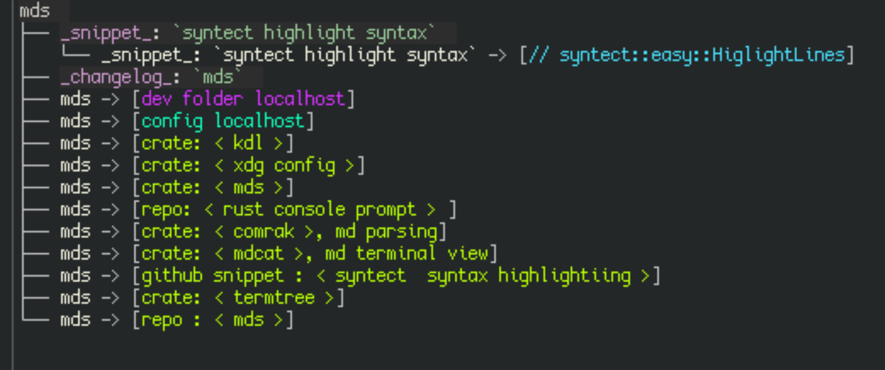

# Meta screenshot



# [Installation](./INSTALLATION.md)

# Enjoy


1. Enjoy ([fast gif tutorial is here](./tutorial.gif)):

  All of `explore`, `surf` and `checkmark` are equipped with `<Ctrl-h>` and `<Ctrl-l>` keybindings to follow 
  backlinks and forward links respectively.

  All of `explore`, `surf` and `checkmark` are equipped with `<Ctrl-t>` keyding to toggle 
  between **details** -> **structural links** -> **structural task** preview of current note or 
  note subgraph respectively. This renders `p/print` command somewhat redundant.

  ```
  mds -h
  ```

  ```
  meudeus v0.13.1
  a skimblade for plain-text papers

  Usage: mds [OPTIONS] <COMMAND>

  Commands:
    debug-cfg  print Debug representtion of config
    init       `initialize` .sqlite database in notes dir, specified by config
    note       create a note [aliases: n]
    tag        create a tag (note without file body) [aliases: t]
    select     select note S, i.e. print its name to stdout
    link       link 2 notes A -> B, selected twice in skim interface [aliases: l]
    unlink     unlink 2 notes A -> B, selected twice in skim interface [aliases: ul]
    remove     remove note R, selected in skim interface [aliases: rm]
    rename     rename note R, selected in skim interface [aliases: mv]
    print      print subgraph of notes and links reachable downwards from selected note P [aliases: p]
    explore    explore notes by <c-h> (backlinks) , <c-l> (links forward) [aliases: ex]
    surf       surf through all links and code snippets found downwards from selected note S [aliases: s]
    checkmark  checkmark, toggle state TODO/DONE of multiple task items, found in a selected note C [aliases: k]
    help       Print this message or the help of the given subcommand(s)

  Options:
    -c, --color    whether color output should be forced
    -h, --help     Print help
    -V, --version  Print version
  ```
# Changelog


